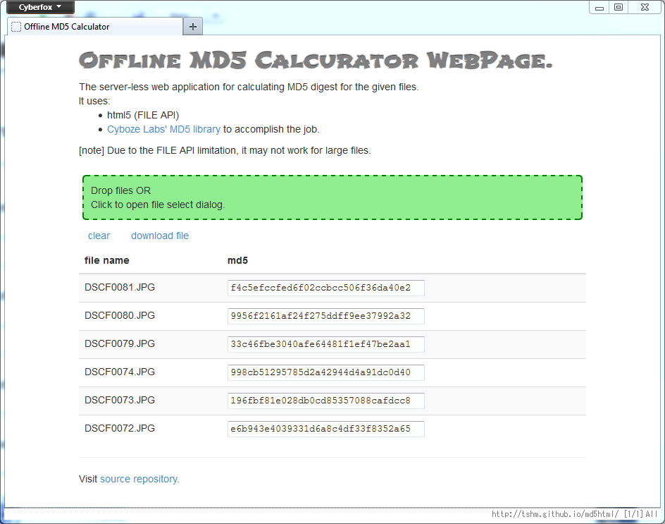
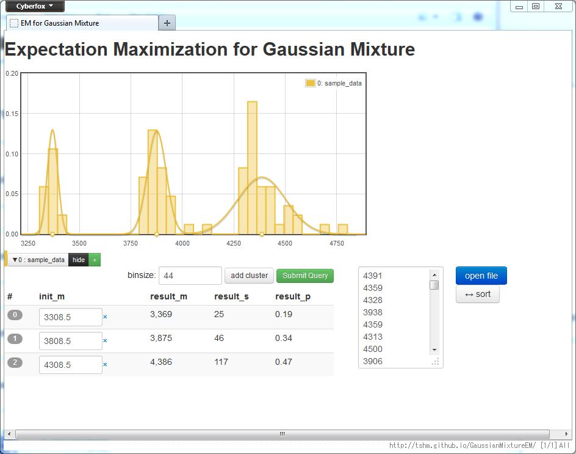
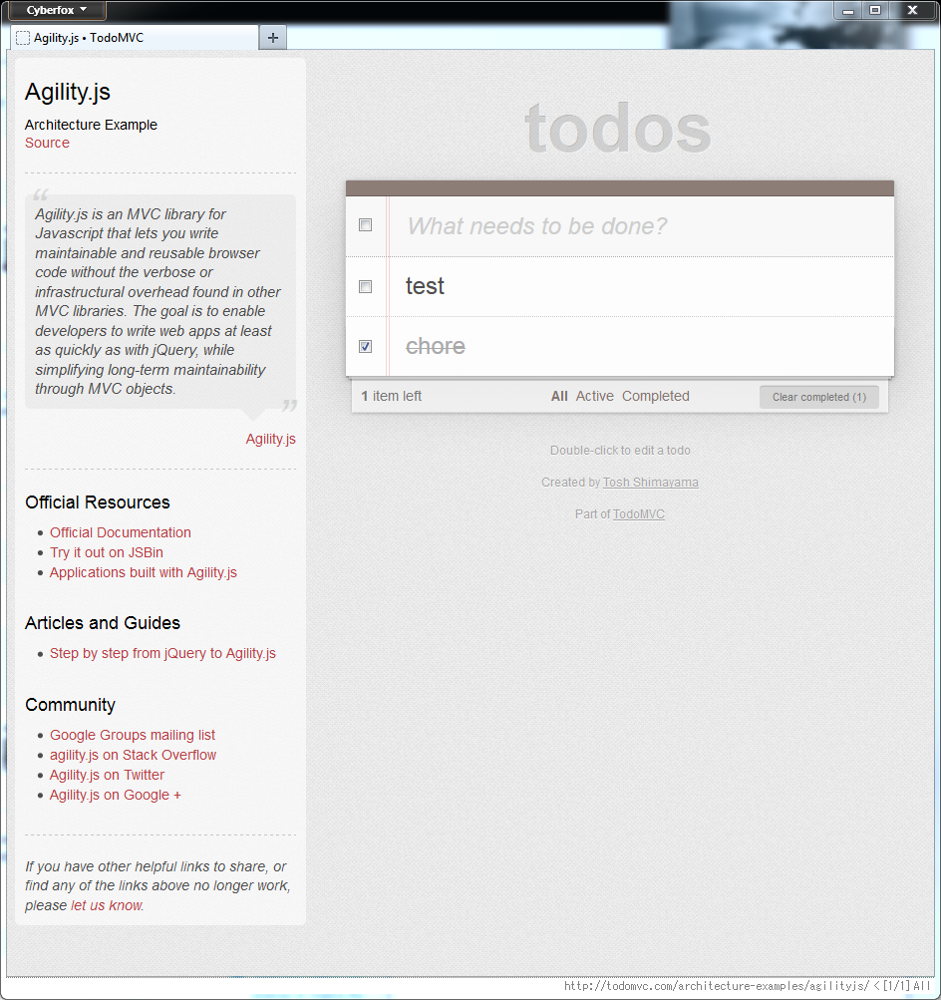

## Web Application: [md5html](http://tshm.github.io/md5html)
Single page web application for calculating digest-hash (e.g. MD5) for
given files.

Used: Javascript/Elm, HTML5(webworker), Picnic CSS

## Web Application: [GaussianMixtureEM](http://tshm.github.io/GaussianMixtureEM)
Single page web application for fitting Mixed
Gaussian distribution using ExpectationMaximization technique.

Used: Javascript/AngularJS, HTML5/Jade, CoffeeScript, Bootstrap, Yeoman/NPM/Grunt

## OpenSource Project Contribution: TodoMVC
I contributed [AgilityJs](https://github.com/arturadib/agility) implementation for
[TodoMVC](http://todomvc.com/)
project.

Used: Javascript/AgilityJs/JQuery, HTML5

## StackOverflow Reputation
I have been providing answers to `Javascript`/`AngularJS`/`Elm` related
questions at 
[StackOverflow](http://stackoverflow.com/users/1238847/tosh-shimayama).

## Others
Other works can be viewed at my github repository list page.
Including:

* Learning excersize for Haskell
* Vim plugin
* C++ math library
* patch contribution to [NeutralinoJs](https://github.com/neutralinojs/neutralinojs) project.
* etc.
